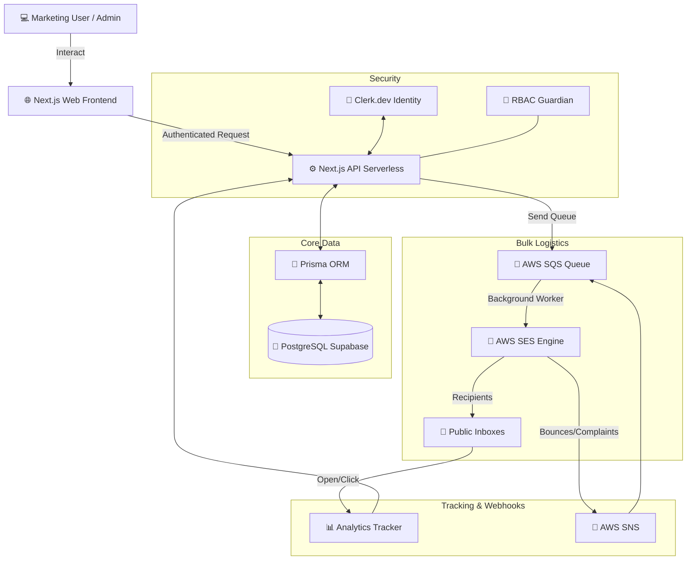

# 🚀 PulseSend | Enterprise Email Campaign Platform

[](https://nextjs.org/)
[](https://tailwindcss.com/)
[](https://www.prisma.io/)
[](https://aws.amazon.com/ses/)

PulseSend is a high-performance, enterprise-grade in-house email platform engineered for modern scale. It empowers marketing teams to manage segmented contact databases, visual create drag-and-drop campaigns, securely schedule high-volume sends via AWS, and analyze deep analytics—all within a secure multi-tenant environment.

Built specifically for the final submission guidelines of the **Email Campaign Platform Build Initiative**.

---

## 🏗️ System Architecture Diagram



---

## 🛠️ Core Feature Blueprint (The 9 Modules)

1.  **🔑 Identity Protocol:** Enterprise Auth powered by Clerk.dev with RBAC (Super Admin, Manager, Viewer).
2.  **📇 Advanced Contacts:** CSV ingestion pipeline with dynamic tagging, list management, and segmentation logic.
3.  **🎨 Visual Studio:** Fully integrated **Unlayer drag-and-drop email builder** with custom block rendering.
4.  **📢 Campaign Forge:** 4-step guided workflow wizard from conception to fully-scheduled delivery confirmation.
5.  **⏱️ Distribution Node:** Hybrid Send architecture leveraging serverless cron dispatchers and AWS SQS queues.
6.  **📊 Live Tracking:** Transparent pixel injection and link redirect interception capturing real-time engagement.
7.  **🛡️ Suppression Matrix:** Automated SNS-to-SQS loop listening for bounces and complaints, auto-locking bad records.
8.  **🚪 Opt-Out Management:** Legal-compliant, branded public unsubscription portal attached automatically.
9.  **📈 Insight Engine:** High-density dashboard charting leveraging SQL aggregation engines for lightning-fast metrics.

---

## 🔑 Environment Configuration

Create a `.env` file in the project root and populate the following strictly required configuration keys:

```env
# --- DATABASE LOGISTICS ---
# Use Supabase Transaction Pooler Port 6543 for Serverless efficiency!
DATABASE_URL="postgresql://[user]:[pass]@[host]:6543/postgres?pgbouncer=true"
DIRECT_URL="postgresql://[user]:[pass]@[host]:5432/postgres"

# --- CLERK IDENTITY SYSTEM ---
NEXT_PUBLIC_CLERK_PUBLISHABLE_KEY="pk_test_..."
CLERK_SECRET_KEY="sk_test_..."
NEXT_PUBLIC_CLERK_SIGN_IN_URL="/login"
NEXT_PUBLIC_CLERK_SIGN_UP_URL="/signup"

# --- AMAZON WEB SERVICES (AWS) ---
AWS_REGION="ap-south-1" # Recommended: Deploy servers in match with DB
AWS_ACCESS_KEY_ID="AKI..."
AWS_SECRET_ACCESS_KEY="..."
AWS_SENDER_EMAIL="verified@yourdomain.com"

# --- AWS STORAGE & QUEUES ---
AWS_S3_BUCKET_NAME="pulsesend-assets"
AWS_SQS_QUEUE_URL="https://sqs.region.amazonaws.com/..."
```

---

## ☁️ AWS SES Integration Checklist

To bridge the infrastructure, follow these 5 execution gates:

1.  **Identity Verification:** Navigate to **AWS SES Console**, create a new Identity, and verify either your root Domain or specific Sender Email address via DNS/Email link.
2.  **Config Set Creation:** Generate an SES Configuration Set named `pulsesend-events` enabling auto-tracking for `Send, Delivery, Open, Click, Bounce, Complaint`.
3.  **Notification Pipe:** Link the configuration set destination to an **AWS SNS Topic**.
4.  **Queue Linkage:** Navigate to **AWS SQS**, spin up a Standard Queue, and Subscribe it to the previously created SNS Topic.
5.  **Role Permissions:** Ensure your `IAM User` possesses `AmazonSESFullAccess`, `AmazonSQSFullAccess`, and `AmazonS3FullAccess` policies attached.

---

## 💻 Local Operations Guide

Ensure you have [Node.js v18+](https://nodejs.org/) installed on your workstation.

1.  **Clone Repositories:**
    ```bash
    git clone https://github.com/BhargavSaiShashank/TheAiSchool.git
    cd TheAiSchool
    ```
2.  **Acquire Dependencies:**
    ```bash
    npm install
    ```
3.  **Synchronize Database Matrix:**
    ```bash
    npx prisma generate
    npx prisma db push
    ```
4.  **Initialize Node Cluster:**
    ```bash
    npm run dev
    ```
    Open [http://localhost:3000](http://localhost:3000) in your browser.

---

*Authored by the PulseSend Development Collective for academic & enterprise evaluation.*
